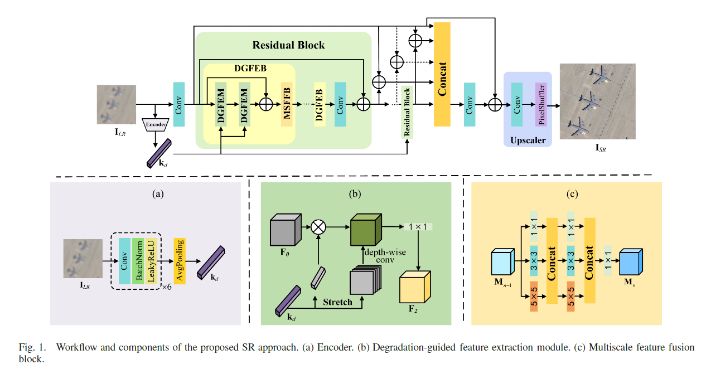
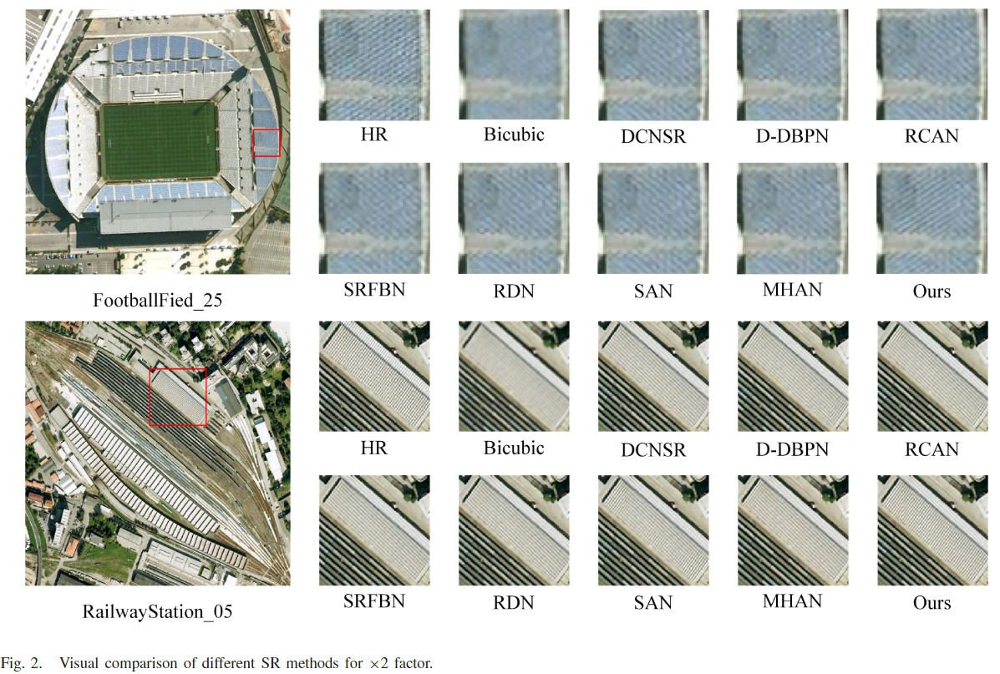
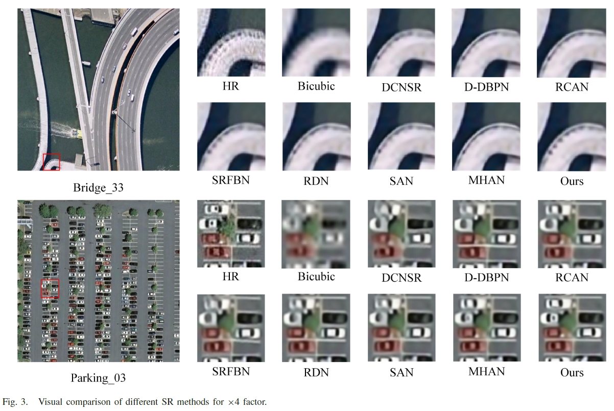
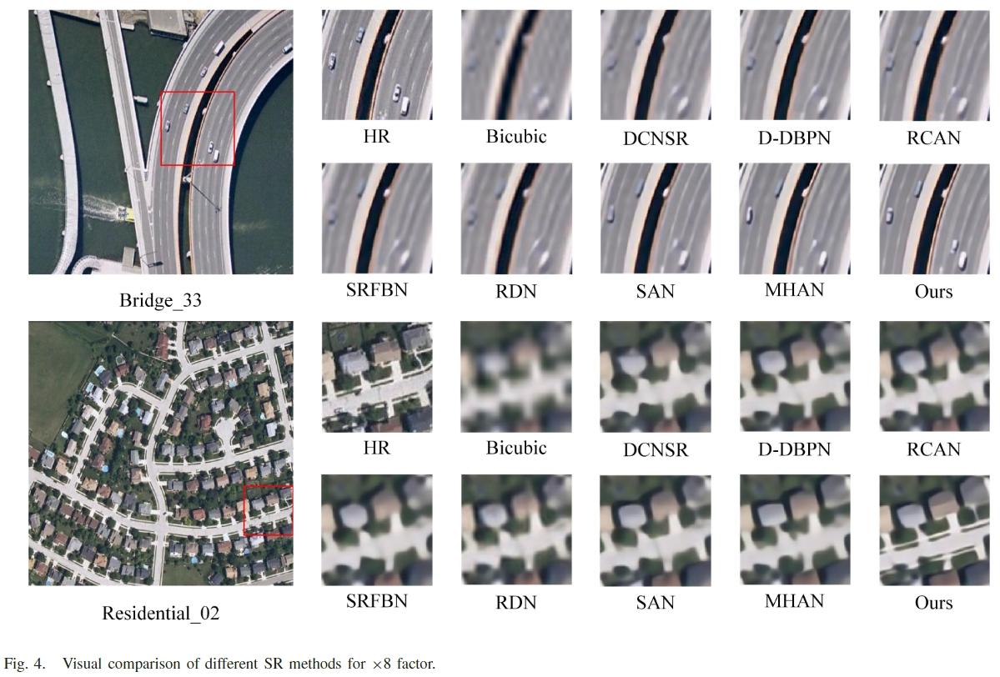

# MDRGBSR
Code for the paper "Multilayer degradation representation-guided blind super-resolution for remote sensing images", TGRS 2022.

The following figure is the architecture of the MDRGBSR model. 

# Dataset
In this work, two widely used remote sensing datasets, i.e., [AID](https://arxiv.org/abs/1608.05167v1) and [WHU-RS19](http://www.escience.cn/people/yangwen/WHU-RS19.html), are adopted,in which the AID dataset is employed to train the proposed model and the WHU-RS19 dataset is used to test the SR performance of all considered approaches.

# Usage
You can train the model by using [main.py](./main.py), and test by using [test.py](./test.py). You should modify the settings in [option.py](./option.py).

# Results display
The results in the paper are shown in the figure below.   

# Pretrained model
You can download the pretrained model [here](https://1drv.ms/u/s!AosHDU8uGUIohD21IcG59xcsbsHy?e=CqUcrX)